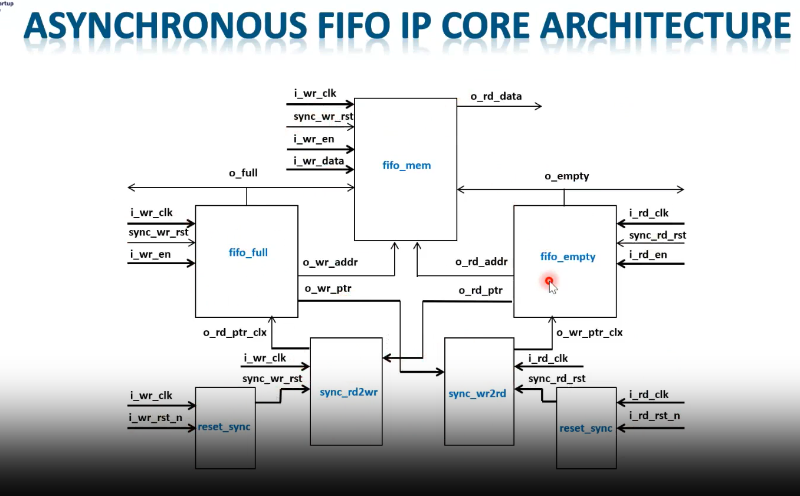
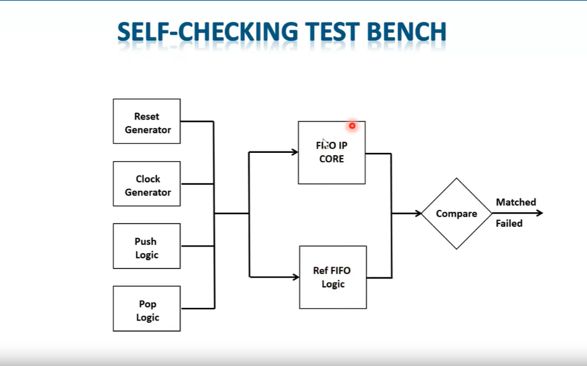
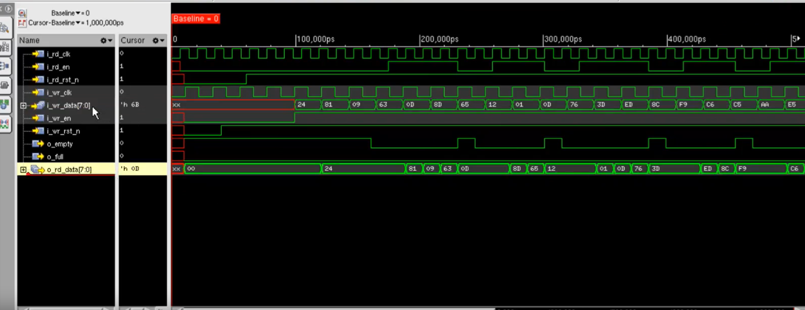

# ASYNC FIFO DESIGN AND VERIFICATION USING VERILOG HDL

## Introduction

Asynchronous FIFO (First-In First-Out) is a widely used Clock Domain Crossing (CDC) component in digital systems. It enables reliable data transfer between two independent clock domains operating at different frequencies.

This project presents an Asynchronous FIFO Design and Verification using Verilog HDL and SystemVerilog. The FIFO uses Gray Code Pointers, Pointer Synchronizers, and Full/Empty Detection Logic to safely transfer data across clock domains.

The design was implemented and verified using Xilinx Vivado 2024.1.

---

## Project Features

* Dual Clock Asynchronous FIFO
* Clock Domain Crossing (CDC)
* Gray Code Pointer Synchronization
* Full Flag Detection
* Empty Flag Detection
* FIFO Memory Design
* Verilog RTL Design
* SystemVerilog Self-Checking Testbench
* Reference Model Verification
* Scoreboard Based Verification
* Vivado Behavioral Simulation
* FPGA Synthesizable RTL

---

## FIFO Architecture



### Architecture Description

The asynchronous FIFO consists of:

* FIFO Memory
* Write Pointer Logic
* Read Pointer Logic
* Full Detection Logic
* Empty Detection Logic
* Pointer Synchronizers
* Reset Synchronizers

---

## Design Methodology

### Write Domain

* Data written using `wr_clk`
* Write pointer increments after successful write
* Full flag prevents FIFO overflow

### Read Domain

* Data read using `rd_clk`
* Read pointer increments after successful read
* Empty flag prevents FIFO underflow

### Pointer Synchronization

* Read pointer synchronized into write clock domain
* Write pointer synchronized into read clock domain
* Gray code used to minimize metastability

---

## Full Flag Logic

FIFO Full Condition:

Next Write Gray Pointer = Inverted MSBs of Synchronized Read Pointer

This prevents FIFO overflow.

---

## Empty Flag Logic

FIFO Empty Condition:

Read Pointer Gray = Synchronized Write Pointer Gray

This prevents FIFO underflow.

---

## RTL Design Files

```text
rtl/
├── async_fifo_top.v
├── fifo_mem.v
├── fifo_full.v
├── fifo_empty.v
├── sync_rd2wr.v
├── sync_wr2rd.v
└── reset_sync.v
```

---

## Verification Environment

### Reference FIFO

* Golden model
* Stores expected data sequence

### Scoreboard

* Compares DUT output with reference model

### Self-Checking Testbench

* Generates write transactions
* Generates read transactions
* Reports PASS/FAIL automatically



### Testbench Files

```text
tb/
├── async_fifo_tb.sv
├── ref_fifo.sv
└── scoreboard.sv
```

---

## Simulation Results

Behavioral simulation verifies:

* Write Operations
* Read Operations
* Full Flag Operation
* Empty Flag Operation
* Data Integrity
* CDC Synchronization

---

## Simulation Waveform



### FIFO Data Integrity Verification

| Transaction | Write Data | Read Data | Status |
| ----------- | ---------- | --------- | ------ |
| 0           | 24         | 24        | PASS   |
| 1           | 81         | 81        | PASS   |
| 2           | 09         | 09        | PASS   |
| 3           | 63         | 63        | PASS   |
| 4           | 0D         | 0D        | PASS   |
| 5           | 8D         | 8D        | PASS   |
| 6           | 65         | 65        | PASS   |
| 7           | 12         | 12        | PASS   |
| 8           | 01         | 01        | PASS   |
| 9           | 0D         | 0D        | PASS   |
| 10          | 76         | 76        | PASS   |
| 11          | 3D         | 3D        | PASS   |
| 12          | ED         | ED        | PASS   |
| 13          | 8C         | 8C        | PASS   |
| 14          | F9         | F9        | PASS   |
| 15          | C6         | C6        | PASS   |

### Simulation Summary

* PASS COUNT = 16
* FAIL COUNT = 0
* TEST PASSED

---

## RTL Schematic


---

## Synthesis Result


---

## Implementation Result


---

## Vivado Design Flow

1. Create RTL Project
2. Add RTL Sources
3. Add Simulation Sources
4. Set Top Module = async_fifo_tb
5. Run Behavioral Simulation
6. Run Synthesis
7. Analyze RTL Schematic
8. Run Implementation
9. Generate Reports

---

## Future Enhancements

* Almost Full Flag
* Almost Empty Flag
* UVM Based Verification
* AXI Stream Interface
* FPGA Hardware Validation

---

## Author

**Muttu Manahalli**

VLSI Design | FPGA | Verilog HDL | SystemVerilog | Vivado
